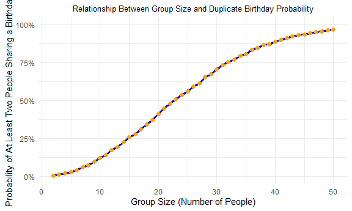
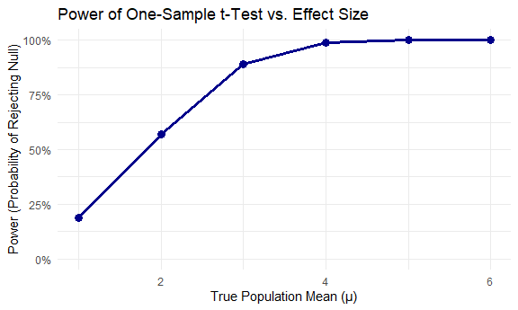
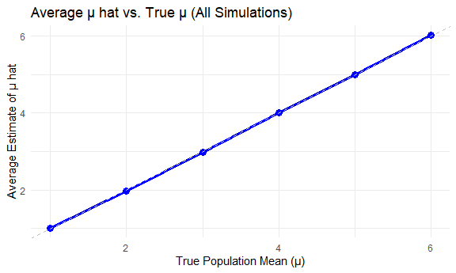
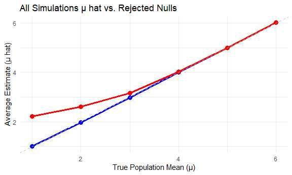
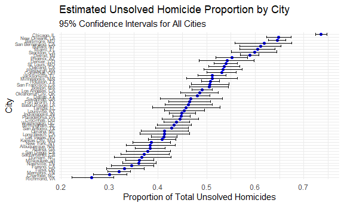

p8105_hw5_yh3964
================
Yirou Hu
2025-11-02

``` r
library(tidyverse)
```

    ## ── Attaching core tidyverse packages ──────────────────────── tidyverse 2.0.0 ──
    ## ✔ dplyr     1.1.4     ✔ readr     2.1.5
    ## ✔ forcats   1.0.0     ✔ stringr   1.5.1
    ## ✔ ggplot2   3.5.2     ✔ tibble    3.3.0
    ## ✔ lubridate 1.9.4     ✔ tidyr     1.3.1
    ## ✔ purrr     1.1.0     
    ## ── Conflicts ────────────────────────────────────────── tidyverse_conflicts() ──
    ## ✖ dplyr::filter() masks stats::filter()
    ## ✖ dplyr::lag()    masks stats::lag()
    ## ℹ Use the conflicted package (<http://conflicted.r-lib.org/>) to force all conflicts to become errors

``` r
theme_set(theme_minimal() + theme(legend.position = "bottom"))  
options(
  ggplot2.continuous.colour = "viridis",
  ggplot2.continuous.fill = "viridis"
)
scale_colour_discrete = scale_color_viridis_d
scale_fill_discrete = scale_fill_viridis_d
knitr::opts_chunk$set(
  echo = TRUE,
  warning = FALSE,
  fig.width = 6,
  fig.asp = .6,
  out.width = "90%"
)
```

# Problem 1

Suppose you put n people in a room, and want to know the probability
that at least two people share a birthday. For simplicity, we’ll assume
there are no leap years (i.e. there are only 365 days) and that
birthdays are uniformly distributed over the year (which is actually not
the case).

- write a function that, for a fixed group size, randomly draws
  “birthdays” for each person;
- checks whether there are duplicate birthdays in the group;
- returns TRUE or FALSE based on the result.

## Define function

``` r
birthday_sim = function(n_room) {
  birthdays = sample(1:365, n_room, replace = TRUE)
  rep_birthday = length(unique(birthdays)) < n_room
  rep_birthday
}
```

- Run this function 10000 times for each group size between 2 and 50.
- For each group size, compute the probability that at least two people
  in the group will share a birthday by averaging across the 10000
  simulation runs.
- Make a plot showing the probability as a function of group size, and
  comment on your results

\##simulation

``` r
group_sizes = 2:50
n_simulations = 10000

birthday_prob = 
  tibble(group_size = group_sizes) |> 
  mutate(
    simulation_results = map(group_size, ~replicate(n_simulations, birthday_sim(.x))),
    prob_duplicate = map_dbl(simulation_results, mean)
  ) |> 
  select(group_size, prob_duplicate)
```

## Visualization

``` r
birthday_plot = 
  birthday_prob |> 
  ggplot(aes(x = group_size, y = prob_duplicate)) +
  geom_line(linewidth = 1.2, color = "blue") +  
  geom_point(size = 2, color = "orange") +       
  labs(
    x = "Group Size (Number of People)",
    y = "Probability of At Least Two People Sharing a Birthday",
    title = "Relationship Between Group Size and Duplicate Birthday Probability",
  ) +
  scale_y_continuous(labels = scales::percent_format(), limits = c(0, 1)) +  
  theme(plot.title = element_text(hjust = 0.5, size = 10))

print(birthday_plot)
```



## Comments

The plot vividly illustrates the birthday paradox phenomenon.

- As the group size grows, the probability of at least two people
  sharing a birthday rises quickly. For example, when the group size
  reaches 23, the probability exceeds 50% for most people, who often
  expect a much larger group size to reach this threshold.

- When the group size approaches 50, the probability nears 100%, meaning
  it is almost guaranteed that at least two people will share a birthday
  in such a group.

- This result highlights how statistical probability can diverge from
  everyday intuition. The rapid rise is driven by the increasing number
  of pairwise comparisons.

## Problem 2

When designing an experiment or analysis, a common question is whether
it is likely that a true effect will be detected – put differently,
whether a false null hypothesis will be rejected. The probability that a
false null hypothesis is rejected is referred to as power, and it
depends on several factors, including: the sample size; the effect size;
and the error variance. In this problem, you will conduct a simulation
to explore power in a one-sample t-test.

- Fix n = 30
- Fix $\sigma$ = 5
- Set $\mu$ = 0
- Generate 5000 datasets from the model: $x ∼ normal [\mu, \sigma]$
- For each dataset, save $\hat{\mu}$ and the p-value arising from a test
  of H: $\mu$ = 0 using $\alpha$ = 0.05

``` r
n_simulations = 5000
n = 30
sigma = 5
mu = 0
alpha = 0.05

# Define the simulation function
simulate_t_test = function(mu, n, sigma) {
  sample = rnorm(n, mean = mu, sd = sigma)
  test_result = t.test(sample, mu = 0, conf.level = 0.95)
  tidy_result = broom::tidy(test_result) |>
    rename(mu_hat = estimate, p_value = p.value)
  return(tidy_result[c("mu_hat", "p_value")])
}

# simulate for 5000 times for mu = 0
simulation_results = map_dfr(1:n_simulations, ~simulate_t_test(mu, n, sigma))
```

Repeat the above for $\mu$ ={1,2,3,4,5,6}, and complete the following:

- Make a plot showing the proportion of times the null was rejected (the
  power of the test) on the y axis and the true value of $\hat{\mu}$ on
  the x axis. Describe the association between effect size and power.

- Make a plot showing the average estimate of $\hat{\mu}$ on the y axis
  and the true value of $\mu$ on the x axis.

- Make a second plot (or overlay on the first) the average estimate of
  $\hat{\mu}$ only in samples for which the null was rejected on the y
  axis and the true value of $\mu$ on the x axis. Is the sample average
  of $\hat{\mu}$ across tests for which the null is rejected
  approximately equal to the true value of $\mu$ ? Why or why not?

``` r
true_mu_values = c(1, 2, 3, 4, 5, 6)

all_sim_results = map_dfr(
  true_mu_values,  
  function(mu) {
    map_dfr(1:n_simulations, ~simulate_t_test(mu, n, sigma)) |>
      mutate(true_mu = mu)
  }
)

power_df = all_sim_results |>
  group_by(true_mu) |>
  summarize(
    power = mean(p_value < alpha),  
    .groups = "drop"
  )

# Power plot
power_plot = power_df |>
  ggplot(aes(x = true_mu, y = power)) +
  geom_point(size = 3, color = "darkblue") +
  geom_line(linewidth = 1.2, color = "darkblue") +
  labs(
    x = "True Population Mean (μ)",
    y = "Power (Probability of Rejecting Null)",
    title = "Power of One-Sample t-Test vs. Effect Size"
  ) +
  scale_y_continuous(labels = scales::percent_format(), limits = c(0, 1)) +
  theme_minimal()

print(power_plot)
```



``` r
mu_hat_analysis = all_sim_results |>
  group_by(true_mu) |>
  summarize(
    avg_mu_hat_all = mean(mu_hat),  
    avg_mu_hat_rejected = mean(mu_hat[p_value < alpha], na.rm = TRUE),
    .groups = "drop"
  )

# Plot for average estimate of mu hat on the y axis and the true value of mu hat on the x axis
mu_hat_all_plot = mu_hat_analysis |>
  ggplot(aes(x = true_mu, y = avg_mu_hat_all)) +
  geom_point(size = 3, color = "blue") +
  geom_line(linewidth = 1.2, color = "blue") +
  geom_abline(intercept = 0, slope = 1, linetype = "dashed", color = "grey") +
  labs(
    x = "True Population Mean (μ)",
    y = "Average Estimate of μ hat",
    title = "Average μ hat vs. True μ (All Simulations)"
  ) +
  theme_minimal()

print(mu_hat_all_plot)
```



``` r
# Plot for all simulations vs rejected nulls
mu_hat_plot = mu_hat_analysis |>
  ggplot() +
  geom_point(aes(x = true_mu, y = avg_mu_hat_all), color = "blue", size = 3) +
  geom_line(aes(x = true_mu, y = avg_mu_hat_all), color = "blue", linewidth = 1.2) +
  geom_point(aes(x = true_mu, y = avg_mu_hat_rejected), color = "red", size = 3) +
  geom_line(aes(x = true_mu, y = avg_mu_hat_rejected), color = "red", linewidth = 1.2) +
  geom_abline(intercept = 0, slope = 1, linetype = "dashed", color = "grey") +
  labs(
    x = "True Population Mean (μ)",
    y = "Average Estimate (μ hat)",
    title = "All Simulations μ hat vs. Rejected Nulls"
  ) +
  theme_minimal()

print(mu_hat_plot)
```



## Comments on three plots and answer questions

- Power vs. True $\mu$: The first plot illustrates a strong positive
  association between the true effect size $\mu$ and the power of the
  one-sample t-test. As $\mu$ increases (from 1 to 6), the probability
  of correctly rejecting the false null hypothesis rises sharply. Power
  plateaus at nearly 100% when $\mu \geq 4$, meaning further increases
  in $\mu$ do not meaningfully improve the ability to detect the effect.

- Average $\hat{\mu}$ Across All Simulations: The second plot (average
  for all tests) shows that the sample mean $\hat{\mu}$ is an unbiased
  estimator of the true $\mu$. The points lie almost exactly on the
  dashed 45° line, indicating that, on average, $\hat{\mu}$ equals the
  true $\mu$ across all simulated samples.

- Average $\hat{\mu}$ for Rejected Tests vs. All Tests: The third plot
  shows that the sample average of $\hat{\mu}$ for tests where the null
  hypothesis is rejected is consistently higher than the true $\mu$,
  particularly for smaller effect sizes. This implies that when the null
  hypothesis is rejected, the estimate of $\mu$ is biased upward. The
  bias arises from a selection effect: only samples with larger
  $\hat{\mu}$ values (due to random variation) result in the null being
  rejected. Thus, the sample average of $\hat{\mu}$ for rejected tests
  is not approximately equal to the true $\mu$, indicating an
  overestimation of the true effect in these cases.

# Problem 3

Describe the raw data. Create a city_state variable (e.g. “Baltimore,
MD”) and then summarize within cities to obtain the total number of
homicides and the number of unsolved homicides (those for which the
disposition is “Closed without arrest” or “Open/No arrest”).

``` r
homicide_data = read_csv("homicide-data.csv")
```

    ## Rows: 52179 Columns: 12
    ## ── Column specification ────────────────────────────────────────────────────────
    ## Delimiter: ","
    ## chr (9): uid, victim_last, victim_first, victim_race, victim_age, victim_sex...
    ## dbl (3): reported_date, lat, lon
    ## 
    ## ℹ Use `spec()` to retrieve the full column specification for this data.
    ## ℹ Specify the column types or set `show_col_types = FALSE` to quiet this message.

``` r
homicides_summary_df =  
  homicide_data |>
  janitor::clean_names() |>
  drop_na() |>
  mutate(city_state = paste(city, state, sep = ", ")) |>
  group_by(city_state) |>
  summarise(
    total_num_homicides = n(), 
    total_num_unsolved_homicides = sum(disposition == "Closed without arrest" | disposition == "Open/No arrest")) |> 
  filter(total_num_unsolved_homicides != 0)

homicides_summary_df
```

    ## # A tibble: 50 × 3
    ##    city_state      total_num_homicides total_num_unsolved_homicides
    ##    <chr>                         <int>                        <int>
    ##  1 Albuquerque, NM                 375                          144
    ##  2 Atlanta, GA                     973                          373
    ##  3 Baltimore, MD                  2827                         1825
    ##  4 Baton Rouge, LA                 424                          196
    ##  5 Birmingham, AL                  799                          346
    ##  6 Boston, MA                      612                          309
    ##  7 Buffalo, NY                     520                          318
    ##  8 Charlotte, NC                   687                          206
    ##  9 Chicago, IL                    5535                         4073
    ## 10 Cincinnati, OH                  694                          309
    ## # ℹ 40 more rows

- The raw data includes 52179 observations and 12 variables.

- We have variables: uid, reported_date, victim_last, victim_first,
  victim_race, victim_age, victim_sex, city, state, lat, lon, and
  disposition.

- Each row represents a single homicide case occurring in one of 50
  cities spanning 28 states.

- For the city of Baltimore, MD, use the prop.test function to estimate
  the proportion of homicides that are unsolved; save the output of
  prop.test as an R object, apply the broom::tidy to this object and
  pull the estimated proportion and confidence intervals from the
  resulting tidy dataframe.

``` r
baltimore_df =
  homicides_summary_df |>
  filter(city_state == "Baltimore, MD") 

baltimore_total = pull(baltimore_df, total_num_homicides)
baltimore_unsolved = pull(baltimore_df, total_num_unsolved_homicides)


baltimore_test_prop = prop.test(baltimore_unsolved, baltimore_total)

baltimore_summary = broom::tidy(baltimore_test_prop) |>
  mutate(
    estimate_p = estimate,
    confidence_low = conf.low,
    confidence_high = conf.high
  ) |>
  select(estimate_p, confidence_low, confidence_high)

baltimore_summary |> 
  knitr::kable()
```

| estimate_p | confidence_low | confidence_high |
|-----------:|---------------:|----------------:|
|  0.6455607 |      0.6275625 |       0.6631599 |

- Now run prop.test for each of the cities in your dataset, and extract
  both the proportion of unsolved homicides and the confidence interval
  for each. Do this within a “tidy” pipeline, making use of purrr::map,
  purrr::map2, list columns and unnest as necessary to create a tidy
  dataframe with estimated proportions and CIs for each city.

``` r
all_city_estimates = homicides_summary_df |>
  group_by(city_state) |>
  summarize(
    prop_test = list(prop.test(total_num_unsolved_homicides, total_num_homicides))
  ) |>
  mutate(tidy_test = purrr::map(prop_test, broom::tidy)) |>
  unnest(tidy_test) |>
  mutate(
    estimate_p = estimate,
    confidence_low = conf.low,
    confidence_high = conf.high
  ) |>
  select(city_state, estimate_p, confidence_low, confidence_high)

all_city_estimates |> 
  knitr::kable()
```

| city_state         | estimate_p | confidence_low | confidence_high |
|:-------------------|-----------:|---------------:|----------------:|
| Albuquerque, NM    |  0.3840000 |      0.3348991 |       0.4355168 |
| Atlanta, GA        |  0.3833505 |      0.3528119 |       0.4148219 |
| Baltimore, MD      |  0.6455607 |      0.6275625 |       0.6631599 |
| Baton Rouge, LA    |  0.4622642 |      0.4141987 |       0.5110240 |
| Birmingham, AL     |  0.4330413 |      0.3984686 |       0.4682665 |
| Boston, MA         |  0.5049020 |      0.4645711 |       0.5451704 |
| Buffalo, NY        |  0.6115385 |      0.5680012 |       0.6534025 |
| Charlotte, NC      |  0.2998544 |      0.2660820 |       0.3358999 |
| Chicago, IL        |  0.7358627 |      0.7239959 |       0.7473998 |
| Cincinnati, OH     |  0.4452450 |      0.4079606 |       0.4831439 |
| Columbus, OH       |  0.5310473 |      0.5007502 |       0.5611206 |
| Dallas, TX         |  0.4811742 |      0.4561942 |       0.5062475 |
| Denver, CO         |  0.5416667 |      0.4846098 |       0.5976807 |
| Detroit, MI        |  0.5883287 |      0.5687903 |       0.6075953 |
| Durham, NC         |  0.3659420 |      0.3095874 |       0.4260936 |
| Fort Worth, TX     |  0.4644809 |      0.4222542 |       0.5072119 |
| Fresno, CA         |  0.3457557 |      0.3037096 |       0.3902951 |
| Houston, TX        |  0.5076713 |      0.4894098 |       0.5259126 |
| Indianapolis, IN   |  0.4493192 |      0.4223156 |       0.4766207 |
| Jacksonville, FL   |  0.5111301 |      0.4820460 |       0.5401402 |
| Kansas City, MO    |  0.4084034 |      0.3803996 |       0.4370054 |
| Las Vegas, NV      |  0.4121080 |      0.3859740 |       0.4387399 |
| Long Beach, CA     |  0.4126984 |      0.3629026 |       0.4642973 |
| Los Angeles, CA    |  0.4900310 |      0.4692208 |       0.5108754 |
| Louisville, KY     |  0.4539130 |      0.4128017 |       0.4956491 |
| Memphis, TN        |  0.3190225 |      0.2957047 |       0.3432691 |
| Miami, FL          |  0.6048387 |      0.5685783 |       0.6400015 |
| Milwaukee, wI      |  0.3614350 |      0.3333172 |       0.3905194 |
| Minneapolis, MN    |  0.5109290 |      0.4585150 |       0.5631099 |
| Nashville, TN      |  0.3606341 |      0.3265669 |       0.3961357 |
| New Orleans, LA    |  0.6485356 |      0.6231048 |       0.6731615 |
| New York, NY       |  0.3856000 |      0.3474692 |       0.4251577 |
| Oakland, CA        |  0.5364308 |      0.5040588 |       0.5685037 |
| Oklahoma City, OK  |  0.4851190 |      0.4467861 |       0.5236245 |
| Omaha, NE          |  0.4132029 |      0.3653146 |       0.4627477 |
| Philadelphia, PA   |  0.4476285 |      0.4298541 |       0.4655364 |
| Phoenix, AZ        |  0.5514223 |      0.5184825 |       0.5839244 |
| Pittsburgh, PA     |  0.5340729 |      0.4942706 |       0.5734545 |
| Richmond, VA       |  0.2634033 |      0.2228571 |       0.3082658 |
| Sacramento, CA     |  0.3716578 |      0.3229312 |       0.4230648 |
| San Antonio, TX    |  0.4278846 |      0.3940800 |       0.4623640 |
| San Bernardino, CA |  0.6181818 |      0.5576628 |       0.6753422 |
| San Diego, CA      |  0.3790850 |      0.3348221 |       0.4254040 |
| San Francisco, CA  |  0.5067873 |      0.4680516 |       0.5454433 |
| Savannah, GA       |  0.4674797 |      0.4041252 |       0.5318665 |
| St. Louis, MO      |  0.5394737 |      0.5152195 |       0.5635446 |
| Stockton, CA       |  0.5981941 |      0.5507455 |       0.6439128 |
| Tampa, FL          |  0.4567308 |      0.3881009 |       0.5269851 |
| Tulsa, OK          |  0.3310463 |      0.2932349 |       0.3711192 |
| Washington, DC     |  0.4379182 |      0.4112495 |       0.4649455 |

- Create a plot that shows the estimates and CIs for each city – check
  out geom_errorbar for a way to add error bars based on the upper and
  lower limits. Organize cities according to the proportion of unsolved
  homicides

``` r
ggplot(all_city_estimates, aes(x = reorder(city_state, estimate_p), y = estimate_p)) +
  geom_point(color = "blue", size = 1.5) +
  geom_errorbar(aes(ymin = confidence_low, ymax = confidence_high)) +
  coord_flip() +
  labs(
    x = "City", 
    y = "Proportion of Total Unsolved Homicides",
    title = "Estimated Unsolved Homicide Proportion by City",
    subtitle = "95% Confidence Intervals for All Cities"
    ) +
  theme(axis.text.y = element_text(size = 6))
```


The plot displays the estimated unsolved homicide proportion across U.S.
cities, sorted by clearance rate (lowest to highest from bottom to top).

Confidence intervals show precise estimates (narrow bars) for
high-volume cities.
